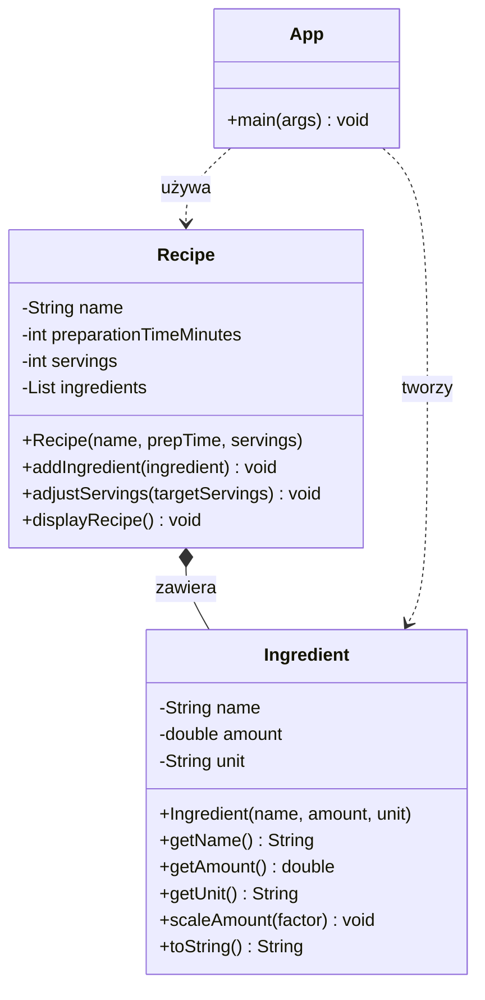

# Diagram Klas - System Przepisów Kulinarnych

```mermaid
classDiagram
    direction TB

    class Ingredient {
        -String name
        -double amount
        -String unit
        +Ingredient(name, amount, unit)
        +getName() String
        +getAmount() double
        +getUnit() String
        +scaleAmount(factor) void
        +toString() String
    }

    class Recipe {
        -String name
        -int preparationTimeMinutes
        -int servings
        -List ingredients
        +Recipe(name, prepTime, servings)
        +addIngredient(ingredient) void
        +adjustServings(targetServings) void
        +displayRecipe() void
    }

    class App {
        +main(args) void
    }

    Recipe *-- Ingredient : zawiera
    App ..> Recipe : używa
    App ..> Ingredient : tworzy
```